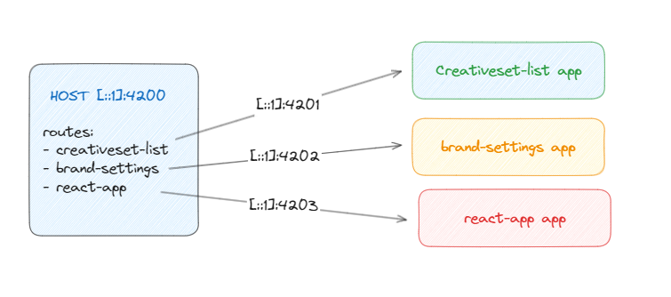

# Module Federation (MFE) Demo

✨ **This workspace has been generated by [Nx, Smart Monorepos · Fast CI.](https://nx.dev)** ✨

# MFE with NX - Overview

This project adopts the cutting-edge technology of Webpack's Module Federation with NX, consolidating into a seamless
workflow of micro-frontends architecture. It consists of a shell app and three remote apps, allowing isolated development,
separate deployment, shared state across the apps and independent technology stacks.

## Micro-frontends Architecture
Instead of building a single monolithic application, we deconstruct it into multiple smaller parts, known as
micro-frontends. It is precisely what micro-services accomplished.

It allows independent teams to work on isolated sections, promoting scalability and ease of
development.

## Case Studies
Big companies like Uber love monorepos and microservices. So it's not far fetched that they also love micro frontends
and module federation. 
Another big case study is the German company Zalando, which has been using micro frontends for a while now.

## Demo App Architecture.

## Shell App

The shell (or host) app is the core application from which all other remote applications are loaded. It acts as a
container for the micro-frontends.

`npx nx serve shell` to start the shell app.

BUT, first start the demo react-app `npx nx serve react-app`

`npx nx serve shell --devRemotes=brand-settings` to dev one app

## Remote Apps

There are three remote apps in this project, which are separately loadable and deployable yet share the same lifecycle
and state as the shell app. They are micro-frontends loaded by the shell app.

For the react example, run `nx run react-app:serve-static` which hosts the app decoupled from the other nx magic.

